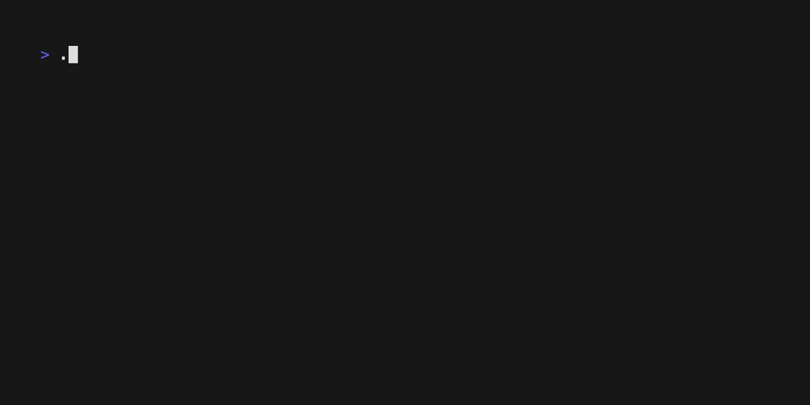

# k8spreview

A terminal-based Kubernetes YAML resource viewer with an interactive TUI interface.

## Features

- Interactive list view of all Kubernetes resources in a YAML file
- Detailed view of individual resources with YAML representation
- Resource relationship visualization
- Interactive graph view showing connections between resources
- Filtering capabilities to quickly find resources
- Color-coded resource types for better visibility
- Keyboard-based navigation



## Installation

### Prerequisites

- Go 1.21 or later (for building from source)
- Git (for building from source)

### Using Go Install

The easiest way to install k8spreview is using Go:

```bash
go install github.com/johnoct/k8spreview@latest  # Latest version
# or
go install github.com/johnoct/k8spreview@v0.1.1  # Specific version
```

### Binary Releases

Download pre-built binaries from the [releases page](https://github.com/johnoct/k8spreview/releases).

### Building from Source

1. Clone the repository:
```bash
git clone https://github.com/johnoct/k8spreview.git
cd k8spreview
```

2. Build using Make:
```bash
make build
```

3. (Optional) Install globally:
```bash
go install
```

### Development Setup

1. Install dependencies:
```bash
go mod download
```

2. Run tests:
```bash
make test
```

3. Build and run with hot reload:
```bash
make dev
```

## Usage

```bash
# View one or more YAML files
k8spreview [file1.yaml file2.yaml ...]

# Read YAML from stdin
cat file.yaml | k8spreview -

# Show version information
k8spreview -version

# Run with example file
make run
```
 
## Automated Releases

We use a PR‑based workflow followed by an explicit tag push to build and publish binaries.

1) Create a bump PR:
```bash
make release-pr v=x.y.z
```
This will:
  • Create a branch `release/vx.y.z` and update `pkg/version/version.go`.
  • Open a GitHub PR titled `chore: bump version to vx.y.z`.

   After review & merge into `main`, proceed to step 2.

2) Tag the release:
```bash
make release-tag v=x.y.z
```
This will:
  • Create and push the annotated tag `vx.y.z`.
  • Trigger the GoReleaser GitHub Actions workflow to build & publish binaries.

### Navigation

- Use arrow keys to navigate the list
- Press `Enter` to view resource details
- Press `g` to view the resource graph
- Press `/` to filter resources
- Press `q` to go back or quit

## Example

```bash
# View a complex example with multiple resources and relationships
k8spreview examples/multi-resource.yaml
```

See the [examples](./examples) directory for more sample YAML files.

## Project Structure

```
.
├── cmd/
│   └── main.go           # Main application entry point
├── pkg/
│   ├── k8s/             # Kubernetes resource handling
│   │   ├── k8s.go       # Core resource types and functions
│   │   └── doc.go       # Package documentation
│   ├── ui/              # TUI components and styling
│   │   ├── app.go       # Application entry point
│   │   ├── model.go     # UI state and update logic
│   │   ├── styles.go    # UI styling definitions
│   │   └── doc.go       # Package documentation
│   └── version/         # Version information
│       └── version.go   # Version, commit, and build date
└── examples/            # Example YAML files
```

## Development

### Available Make Commands

```bash
make help          # Show available commands
make build         # Build the application
make test          # Run tests
make test-coverage # Run tests with coverage report
make clean         # Clean build artifacts
make run           # Build and run the application
make dev           # Run with hot reload
make fmt           # Format code
make lint          # Run linter
make verify        # Run format, lint and tests
make release v=x.x.x # Create and push a new release
```

### Running Tests

Run all tests:
```bash
make test
```

Run tests with coverage:
```bash
make test-coverage
```

### Code Style

The project follows standard Go code style. Before committing, ensure your code passes verification:

```bash
make verify
```

This will:
1. Format the code with `gofmt`
2. Run the linter
3. Run all tests

### Release Process

1. Create a new release:
```bash
make release v=0.1.3
```

This will:
- Update version in `pkg/version/version.go`
- Create and push a git tag
- Trigger GitHub Actions to:
  - Build binaries for all platforms
  - Create a GitHub release
  - Upload the binaries

## Contributing

1. Fork the repository
2. Create your feature branch (`git checkout -b feature/amazing-feature`)
3. Make your changes and run verification (`make verify`)
4. Commit your changes (`git commit -m 'Add some amazing feature'`)
5. Push to the branch (`git push origin feature/amazing-feature`)
6. Open a Pull Request

## License

This project is licensed under the MIT License - see the [LICENSE](LICENSE) file for details.

## Acknowledgments

- [Bubble Tea](https://github.com/charmbracelet/bubbletea) - Terminal UI framework
- [Lip Gloss](https://github.com/charmbracelet/lipgloss) - Style definitions
- [YAML v3](https://github.com/go-yaml/yaml) - YAML parsing
- [GoReleaser](https://goreleaser.com/) - Release automation

